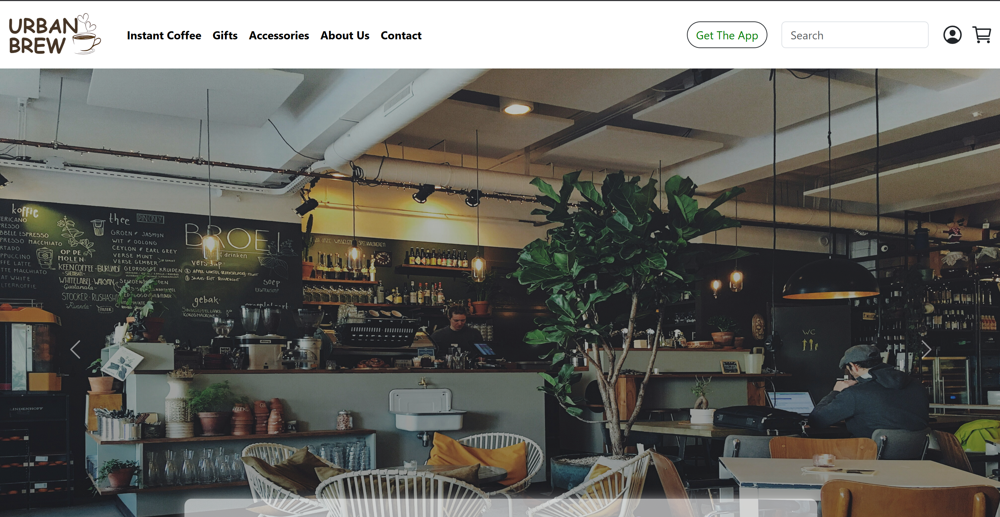
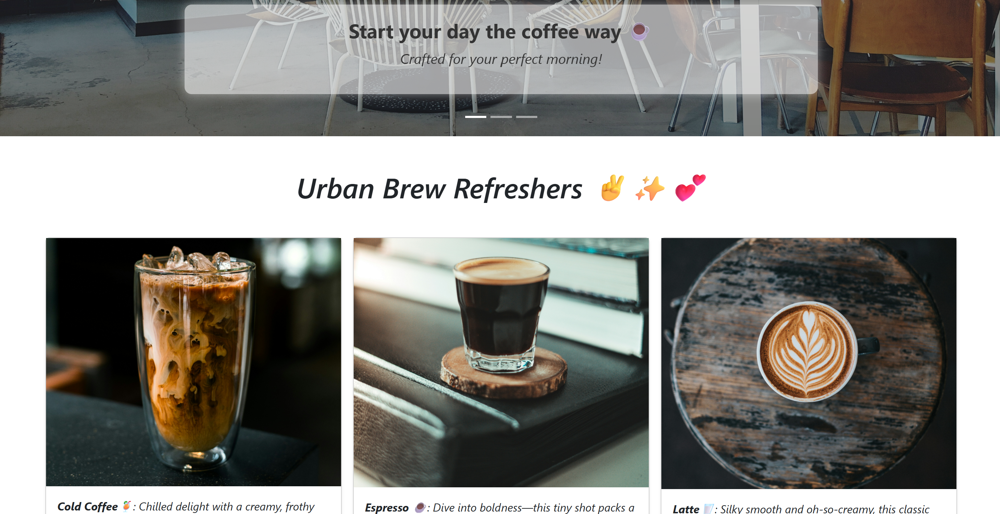
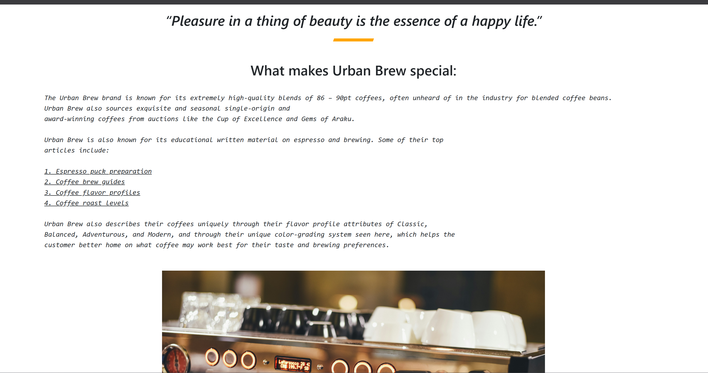
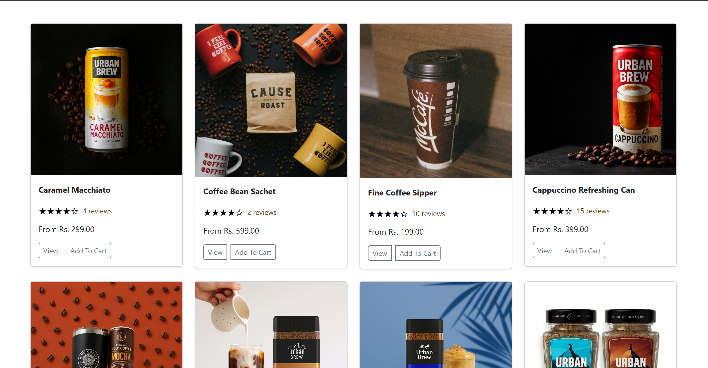
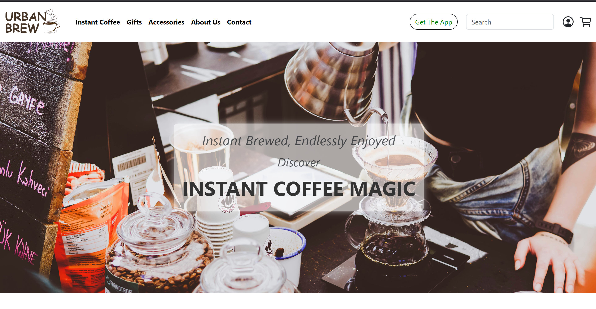
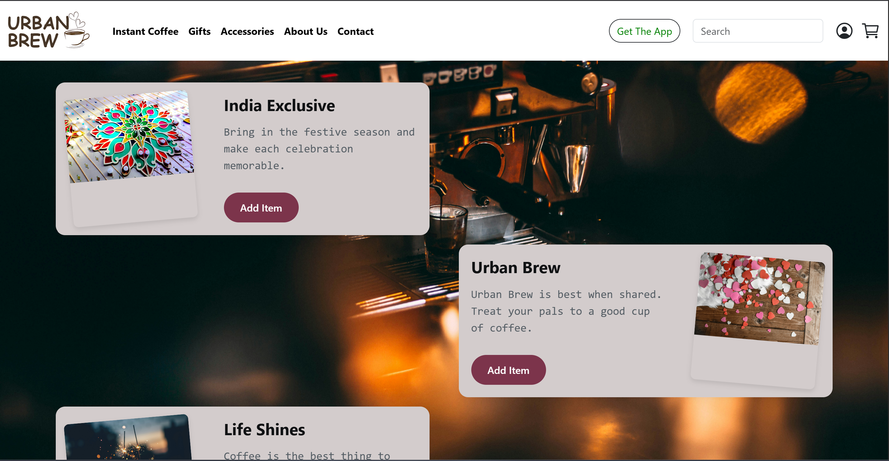
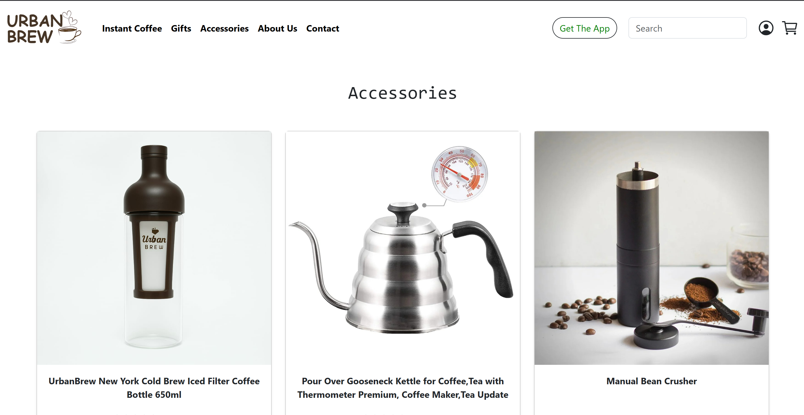
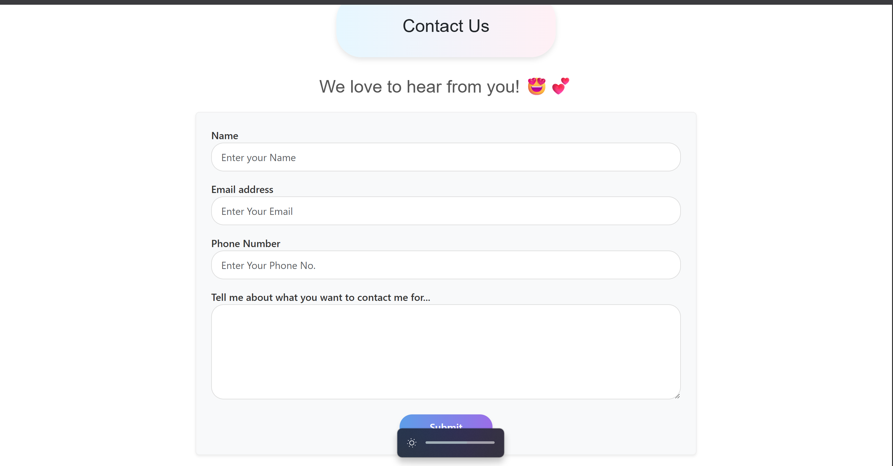

# ☕ **Urban Brew**
*Where Every Sip Tells a Story*

Welcome to Urban Brew - your digital gateway to the perfect coffee experience. We're not just serving coffee; we're crafting moments, building community, and brewing connections one cup at a time.

<div align="center">
  
  
</div>

---

## **Table of Contents**
* [About Urban Brew](#about-urban-brew)
* [What Makes Us Special](#what-makes-us-special)
* [Features](#features)
* [Getting Started](#getting-started)
* [Installation](#installation)
* [Usage](#usage)
* [Contributing](#contributing)
* [Terms & Love](#terms--love)

---

## **About Urban Brew**
Urban Brew isn't just another coffee app - it's your personal barista, gift curator, and coffee companion all rolled into one delightful experience. Whether you're a coffee connoisseur or just someone who appreciates the finer things in life, we've crafted something special just for you.

**Our Mission:** To transform your daily coffee ritual into an extraordinary experience through technology, community, and exceptional taste.

<div align="center">
  
</div>

---

## **What Makes Us Special**

### 🌟 **The Urban Brew Experience**
- **Curated Coffee Selection:** From bold espressos to smooth cold brews, every drink is a masterpiece
- **Thoughtful Gifts:** Surprise your loved ones (or yourself) with coffee-inspired treasures
- **Premium Accessories:** Elevate your brewing game with our handpicked collection
- **Warm Community:** Connect with fellow coffee lovers in our cozy digital space

---

## **Features**

### ☕ **Coffee Perfection**
- **Signature Refreshers:** Unique blends you won't find anywhere else
- **Customization Magic:** Make every drink exactly how you like it
- **Seasonal Specials:** Limited-time offerings that celebrate the flavors of each season

<br>
<div align="center">
  
  
</div>
<br>

### 🎁 **Thoughtful Gifting**
- **Curated Gift Sets:** Perfect for coffee lovers in your life
- **Digital Gift Cards:** Instant happiness, delivered electronically
- **Subscription Boxes:** The gift that keeps on brewing

<br>
<div align="center">
  
</div>
<br>

### 🛍️ **Premium Accessories**
- **Brewing Equipment:** From French presses to pour-over sets
- **Stylish Mugs & Tumblers:** Sip in style with our exclusive designs
- **Coffee Storage Solutions:** Keep your beans fresher, longer

<br>
<div align="center">
  
</div>
<br>

### 🏠 **Lovely Environment**
- **Interactive UI:** Every tap, swipe, and scroll feels like a warm embrace
- **Mood-Based Themes:** Match your app experience to your coffee mood
- **Community Features:** Share your coffee moments with our growing family

---

## **Getting Started**

### **Prerequisites**
Before diving into the Urban Brew experience, ensure you have:
- Python 3.8+ installed on your local machine
- Django 4.0+ framework
- A love for exceptional coffee ☕
- An appreciation for beautiful, functional design

### **What You'll Need**
- Access to our coffee API for real-time menu updates
- Payment gateway integration for seamless transactions
- Push notification services for order updates

---

## **Installation**

Ready to brew something amazing? Let's get started:

### 1. **Clone Our Coffee Haven**
```bash
git clone https://github.com/yourusername/urban-brew-coffee-app.git
```

### 2. **Enter the Urban Brew World**
```bash
cd urban-brew-coffee-app
```

### 3. **Install the Magic**
```bash
pip install -r requirements.txt
```

---

## **Usage**

### **Start Your Coffee Journey**
```bash
python manage.py runserver
```

Visit `http://localhost:8000` and watch the magic unfold! ✨

---

## **Contributing**

We believe the best ideas come from collaboration (much like the perfect coffee blend). Here's how you can be part of our story:

---

## **Terms & Love**

### **Our Promise**
Urban Brew is crafted with love for the coffee community. This project is currently for non-commercial use, but we're brewing plans for something bigger. Stay tuned!


---

## **Contact Us**

Have questions or just want to say hi? We'd love to hear from you!

<div align="center">
  
</div>

---

## **A Final Sip of Gratitude**

Thank you for being part of the Urban Brew journey. Whether you're here to code, contribute, or just appreciate good coffee, you're exactly where you belong.

*"Life's too short for bad coffee and boring apps. Let's make both extraordinary."*

---

**Made with ☕ and 💝 by coffee lovers, for coffee lovers**

*Urban Brew - Where Every Sip Tells a Story*
